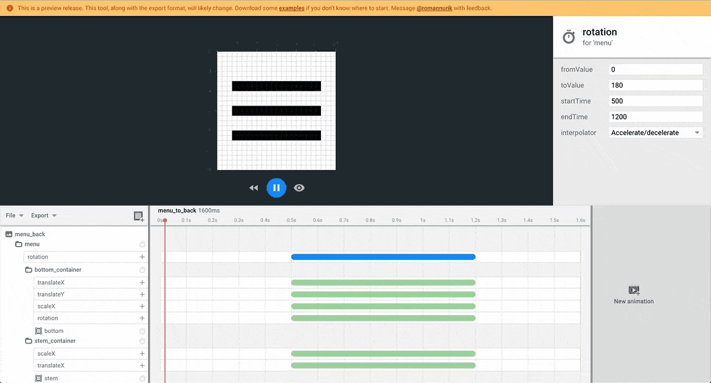

# Android Icon Animator

**[Go to Live Version](https://romannurik.github.io/AndroidIconAnimator/)**

-----

A web-based tool that lets you design icon animations and other animated vector art for Android.
Exports to [Animated Vector Drawable](https://developer.android.com/reference/android/graphics/drawable/AnimatedVectorDrawable.html)
format for Android.

Not intended to replace After Effects or other professional animation tools, but very useful for
simple animations.



## Build instructions

If you want to contribute, you can build and serve the web app locally as follows:

  1. First install [Node.js](https://nodejs.org/) and [npm](https://www.npmjs.com/).

  2. Install `bower` and `gulp`:

    ```
    $ npm install -g bower gulp
    ```

  3. Clone the repository and in the root directory, run:

    ```
    $ npm install
    ```

  4. To build and serve the web app locally, run:

    ```
    $ gulp serve
    ```
